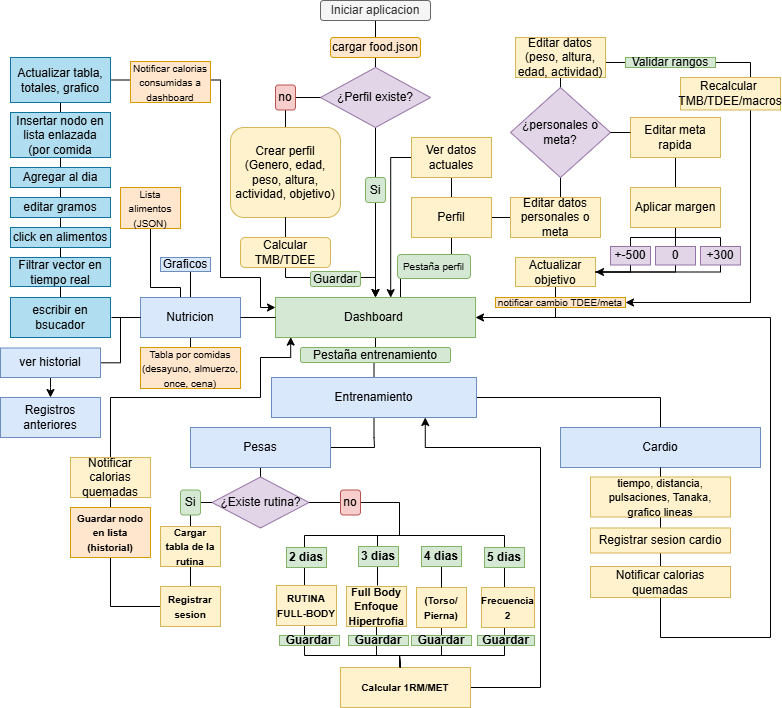

# VitalCoreFit
> Plataforma integrada de salud personal: nutrición y entrenamiento físico.
> Aplicación de escritorio desarrollada en C++17 con el framework Qt 6.5.
> Proyecto desarrollado por estudiantes de Ingeniería Civil en Telemática de la Universidad Técnica Federico Santa María (UTFSM).

## Descripción
VitalCoreFit soluciona el problema de tener que utilizar múltiples aplicaciones desconectadas para llevar un control de la salud. Unifica el registro nutricional y la planificación de rutinas de gimnasio en un solo perfil local, automatizando cálculos matemáticos complejos (como la TMB, 1RM y eficiencia cardíaca) para entregar un balance energético neto en tiempo real. 

## Funcionalidades
- [ ] **Perfil de usuario:** Cálculo automático de TMB y TDEE utilizando la ecuación de Mifflin-St Jeor.
- [ ] **Módulo de Nutrición:** Registro diario de alimentos gestionado mediante listas enlazadas en memoria dinámica y persistencia en una base de datos `JSON` local.
- [ ] **Módulo de Entrenamiento (Pesas):** Generación de rutinas y cálculo de fuerza máxima (1RM) con la fórmula de Brzycki.
- [ ] **Módulo de Entrenamiento (Cardio):** Seguimiento de la eficiencia cardíaca con la fórmula de Tanaka.
- [ ] **Dashboard Principal:** Balance energético neto interactivo utilizando `QtCharts` para la visualización de datos.

## Arquitectura

## Detalles Técnicos y Requisitos
- **Lenguaje:** C++17 (Estándar moderno).
- **Framework GUI:** Qt 6.5 (Módulos: Core, Gui, Widgets, QtCharts).
- **Entorno:** Qt Creator 11.
- **Gestión de Memoria:** Implementación estricta de punteros y memoria dinámica (Heap), validada mediante Valgrind para asegurar la ausencia de memory leaks.
- **Persistencia:** Archivos locales estructurados en formato JSON.
- 
## Equipo
| Nombre | Módulo principal |
|--------|-----------------|
| Nicolás Silva | Perfil de usuario, Gráficos Qt |
| Martín Pérez | Módulo de Nutrición |
| Álvaro Machuca | Módulo de Entrenamiento |
